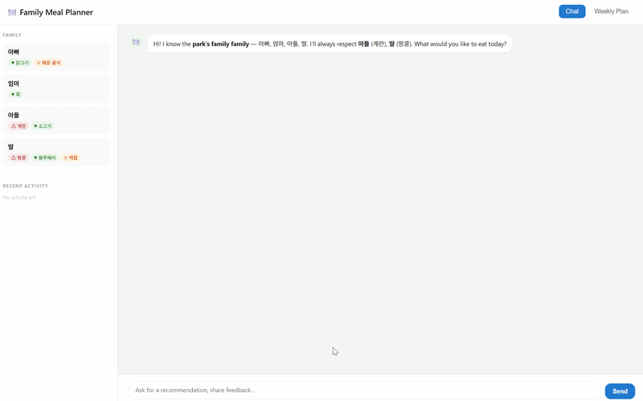
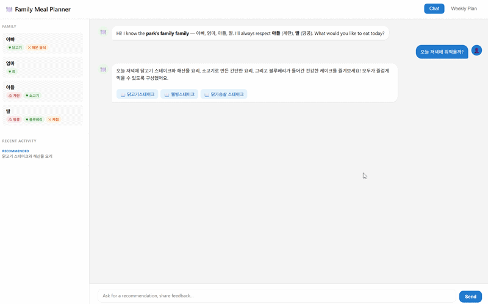
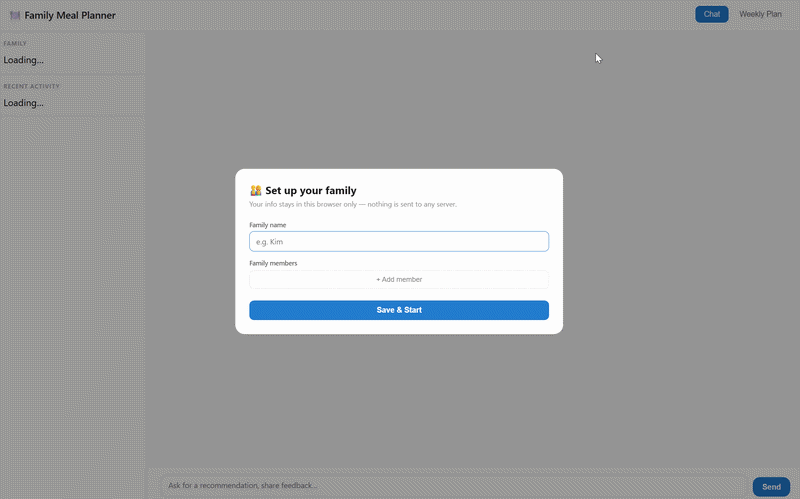
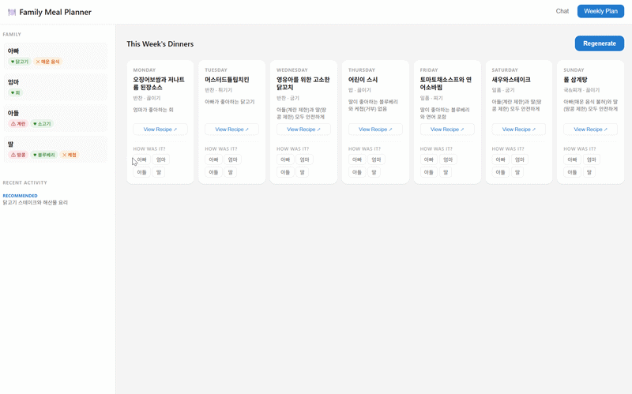

# Family Meal Planner

[](LICENSE)

A RAG-based meal planning assistant that learns your family's preferences over time. Powered by a local vLLM server and ChromaDB. Personal data never leaves the browser.

## Demo

**Ask for a dinner recommendation**



**Weekly meal plan**



**Add a family member**



**Give feedback on a recipe**



## Key design decisions

**Agentic loop over RAG pipeline**
Instead of a fixed retrieve-then-generate flow, the LLM drives the process through tool calls. It decides when to search, how many times, what to filter on, and when to log results — making the behaviour adaptive rather than scripted.

**Profile as retrieval context**
The family profile (members, restrictions, likes, dislikes) is injected as the system prompt on every request. The LLM uses it to shape queries before hitting ChromaDB, so retrieval is preference-aware from the start rather than filtered after the fact.

**Profile learns from conversation**
Feedback ("my son loved it", "too spicy for dad") is extracted by the LLM via `log_feedback` tool calls. A `refresh_profile` tool rewrites the profile from accumulated history using a second LLM call — no manual updates needed.

**Stateless server, personal data in the browser**
Profile and history are stored in `localStorage` and sent with each request. The server never writes personal data to disk — it receives state, processes it, and returns mutations as events for the browser to apply. This avoids any data handling obligations for a demo.

## How it works

```
Browser (localStorage)
  profile + history
       │
       ▼  sent with each request
  FastAPI server
       │
       ▼
  MealPlanner — agentic loop (up to 10 iterations)
       │
       ├── search_recipes   → ChromaDB (BAAI/bge-m3 embeddings)
       ├── log_recommendation → event returned to browser
       ├── log_feedback      → event returned to browser
       ├── add_member        → mutates profile, returned to browser
       ├── update_member     → mutates profile, returned to browser
       └── refresh_profile   → LLM rewrites profile from feedback history
       │
       ▼
  {result, events, profile}  → browser applies to localStorage
```

## Stack

| Layer | Technology |
|---|---|
| LLM serving | vLLM (OpenAI-compatible, any model) |
| Embeddings | `BAAI/bge-m3` via `sentence-transformers` |
| Vector DB | ChromaDB (persistent, local) |
| Backend | FastAPI |
| Frontend | Vanilla JS + localStorage |
| Recipe data | Korean Food Safety OpenAPI (1,146 recipes) |

## Setup

### 1. Start vLLM

Tool calling requires these flags:

```bash
python -m vllm.entrypoints.openai.api_server \
  --model <your-model> \
  --enable-auto-tool-choice \
  --tool-call-parser hermes
```

See [kavaroll/vllm-serving-kit](https://github.com/kavaroll/vllm-serving-kit) for a ready-made vLLM serving setup.

### 2. Configure environment

```bash
cp .env.example .env
```

```
LLM_URL=http://localhost:8000
LLM_MODEL=your-model-name
CHROMA_PATH=data/vectordb
```

### 3. Install dependencies

```bash
pip install -r requirements.txt
```

### 4. Ingest recipe data

Edit `ingest_data/fetch.py` with your data source, then:

```bash
python -m ingest_data.fetch
python -m ingest_data.build_vector_db
```

### 5. Run

```bash
uvicorn app.main:app --port 8080
```

Open `http://localhost:8080`. A setup form appears on first visit — enter your family info. Everything is saved locally in the browser.

## API

| Method | Endpoint | Description |
|---|---|---|
| `POST` | `/chat` | Main conversation endpoint |
| `POST` | `/plan/week` | Generate structured 7-day meal plan |
| `GET` | `/recipes/{id}` | Fetch full recipe from ChromaDB |
| `GET` | `/profile` | Read profile from disk (fallback) |
| `POST` | `/profile/setup` | Write initial profile to disk (fallback) |

`/chat` and `/plan/week` accept `profile` and `history` in the request body. If provided, those are used instead of any disk-based state.

## File structure

```
app/
  api/
    routes.py           # FastAPI endpoints
    schemas.py          # Pydantic models
  db/
    chroma.py           # ChromaDB client
  prompts/
    meal_planner.txt    # System prompt + tool guidelines
    plan_week.txt       # Structured weekly plan prompt
    refresh_profile.txt # Profile refresh prompt
  services/
    llm.py              # vLLM client (OpenAI-compatible)
    retriever.py        # ChromaDB search with metadata filters
    planner.py          # Agentic loop, tool definitions, event buffering
    profile.py          # File-based profile/history (fallback / CLI use)
  config.py
  main.py
  setup.py              # CLI for initial profile setup

ingest_data/
  fetch.py              # Data ingestion (edit per source)
  build_vector_db.py    # Embed and load into ChromaDB

static/
  index.html            # Single-page UI (chat + weekly plan)

data/
  raw/recipes.json
  vectordb/
```
